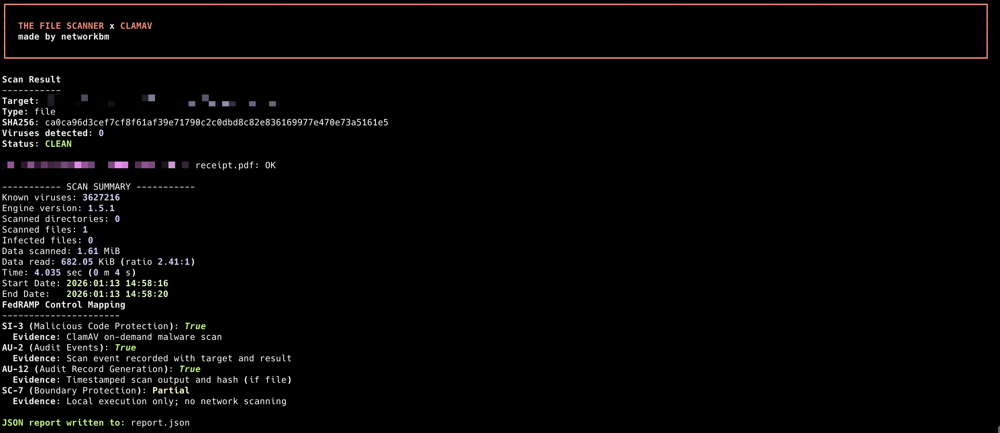

# The File Scanner x ClamAV  
**made by networkbm**

A local, terminal based file and directory scanning tool built in Python using **ClamAV**.  

## Features

- File and recursive directory scanning
- SHA-256 hashing for individual files
- Per-file scan results (shows exactly which file triggered a detection)
- Live animated scan indicator
- JSON report export
- Audit logging (JSON Lines format)
- FedRAMP / NIST 800-53 control mapping (evidence-based)
- Clean exit codes for automation
- Styled terminal UI with banner

## Requirements

- macOS or Linux
- Python 3.10+
- ClamAV installed and signatures updated

---

## Project Setup

Clone the repository and enter the project directory:

```bash
cd filescanner
```
## Create and activate a virtual environment:
```bash
python3 -m venv venv
```
```bash
source venv/bin/activate
```
## Install Python dependencies:

```bash
pip install rich
```
## Scan a single file
```bash
python cli.py ~/Downloads/pizza.pdf
```
## Scan a directory recursively
```bash
python cli.py ~/Downloads
```
## Scan and export a JSON report
```bash
python cli.py ~/Downloads --json report.json
```
## Terminal Output

The tool displays:
A banner: The File Scanner x ClamAV
A live animated scanning indicator
Scan summary (target, type, hash if applicable)
Virus detection count
Detection details (only if malware is found)
FedRAMP control mapping
Example fields:
Viruses detected: 0
Status: CLEAN or Status: INFECTED
JSON Report Output
When the --json flag is used, the tool writes a structured report containing:
UTC timestamp
Tool metadata
Full scan results
Per-file detection results
ClamAV scan summary
FedRAMP control mapping

---

## Screenshot


